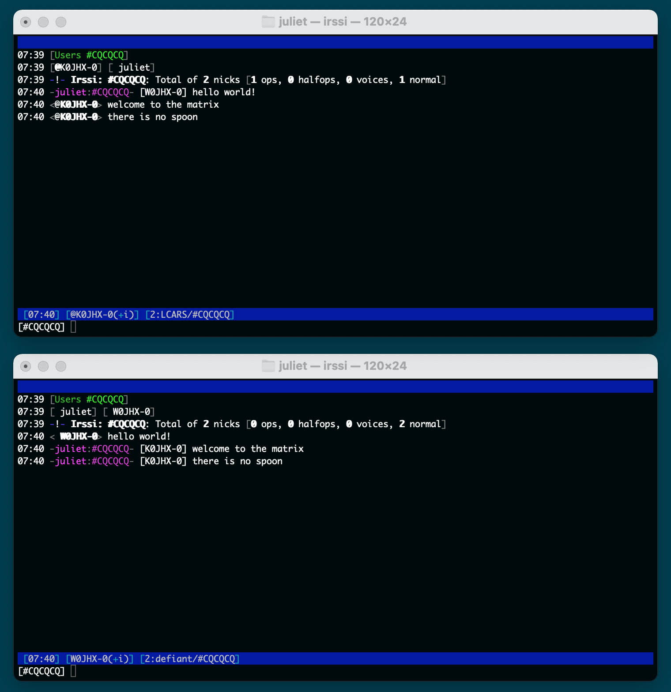

# juliet #

Juliet is an IRC bot that exchanges channel messages over a radio network.  The intended
use for this bot is to enable communications by amateur radio operators when standard
infrastrastructure is not available.  While it was designed with D-STAR in mind, any
radio capable of exchanging data over a standard serial port _should_ work.

There are several other good programs for messaging using amateur radios, why make one
more?  Well, mostly to learn how it's done.  In addition, using a standard like IRC opens
additional possibilities for relayed messages and the use of any standard IRC chat client.

Written by W0JHX.  Tested using Icom 92AD with the standard programming cable.



## Setup ##

At the moment, there is no installer for `juliet`, simply download the repository to an
appropriate folder on your computer.

Before using `juliet`, you will need to install the modules from `requirements.txt`:

```
python3 -m install -r requirements/core.txt
```

*NOTE* Advanced users may wish to do this using `venv` to avoid changes in their
system libraries.

## Usage ##

From the `src` directory, run the `juliet` module with your specified config:

```
python3 -m juliet juliet.cfg
```

- Find or setup an IRC server (`ngircd` is a good one).
- Connect to your radio's serial interface (or programming cable).
- Create a configuration file (see Configuration below).
- Run the `juliet` module using local config.
- Connect to the server using any IRC client of your choice.
- Channels where `juliet` has joined will be relayed over the radio!

Outgoing messages will be rate limited to 1 line per second.  This is primarily to help
avoid frequency congenstion.

## Configuration ##

This documentation is missing...  For now, please use the sample `juliet.cfg` file to
get started.

## Technical Info ##

It is hard to find information online about some of this stuff, so here is some detail
that I've uncovered along the way.  Note that this is not intended to be a complete
reference for using D-STAR, just some useful information while writing this application.

### Connecting to the radio ###

D-STAR radios typically have a serial port for programming.  This port will also accept and
relay data from the radio.  In most cases, simply opening the serial port is enough to
access low-bandwidth data from the radio.

Some radios must be placed in "Auto TX" mode (rather than PTT) in order to send any serial
data automatically.

Also, be sure to disable automatic GPS reporting when using a radio with Juliet.  This will
mangle the data stream such that it cannot be parsed.

### D-STAR data format ###

The D-STAR spec does not define any structure for the data stream, leaving it up to each
application.  Most radios use a similar format for transmitting GPS data.  You may see these
messages in the log file, but they are ignored by Juliet.

### Juliet message format ###

**WORK IN PROGRESS**

```
>>{version}:{crc16}:{sender}:{timestamp}:{content}:{signature}<<
```

* `version` (required) - specify the version of the message structure - see below
* `crc16` (required) - the checksum for the message (sender, content, sequence, signature)
* `sender` (required) - the sender of the message
* `timestamp` (required) - the timestamp when the message was sent
* `content` (required) - main content of the message; length of the message is not restricted
* `signature` (optional) - digital signature used to authenticate the sender (not used currently)

#### Message Types ####

The `version` field denotes both message structure as well as content type.

* 0 - uncompressed text
* 1 - compressed & base-64 encoded text
* 3 - channel text
* 7 - file message - currently unused, but here for completeness

## Contributions ##

If you are interested in contributing to `juliet`, I would welcome the help!  Feel free
to send me a message or just fork this repo and submit a pull request.

_-73_
